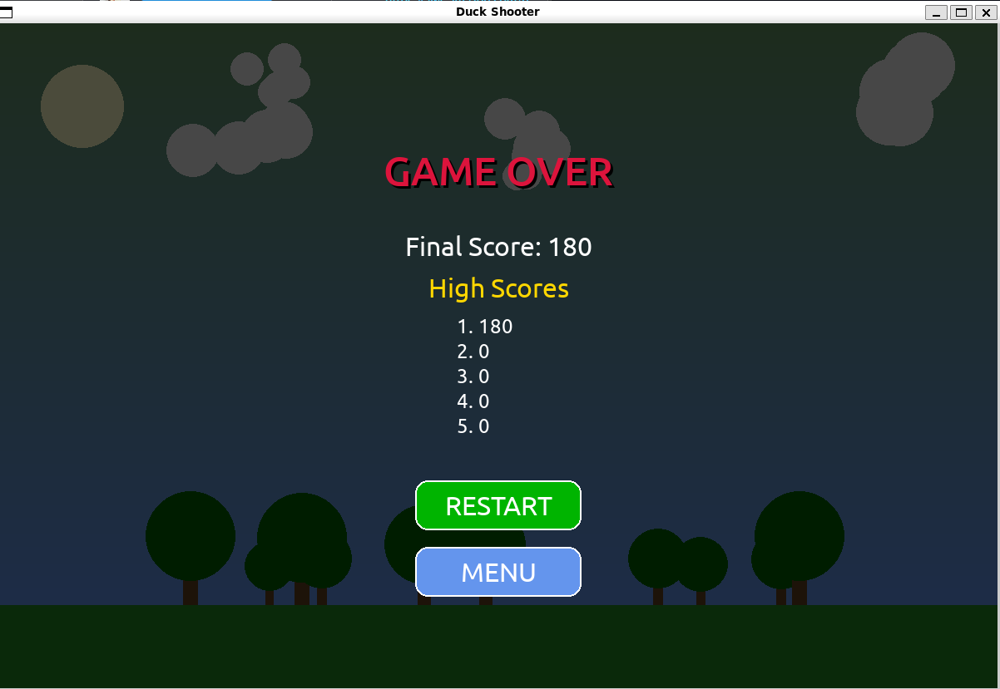

# Duck Shooter Game

A modern duck shooting game built with Pygame where players can aim and shoot ducks using different weapons including guns, knives, stones, and bow & arrows.



## Features

### Weapons System
- **Gun**: Fast firing rate with medium damage
- **Knife**: Medium firing rate with high damage
- **Stone**: Slow firing rate with low damage
- **Bow**: Slowest firing rate but highest damage
- Each weapon has limited ammunition

### Duck Types
- **Normal Ducks**: Standard health and speed
- **Fast Ducks**: Lower health but move quicker
- **Armored Ducks**: Higher health but move slower
- **Golden Ducks**: Very low health but fast and worth more points

### Power-up System
- **Rapid Fire**: Decreases weapon cooldown time
- **Double Damage**: Increases damage dealt to ducks
- **Slow Motion**: Slows down duck movement
- **Multi-Shot**: Fires three projectiles at once

### Game Progression
- Multiple levels with increasing difficulty
- More challenging duck types appear at higher levels
- Time bonus when completing a level
- High score tracking

### Modern UI
- Sleek menu screen with animated elements
- In-game HUD showing score, level, and time
- Weapon selection interface with ammo indicators
- Pause menu functionality
- Game over screen with high scores

## Installation

### Prerequisites
- Python 3.6 or higher
- Pygame 2.0.0 or higher
- NumPy (for sound generation)

### Setup
1. Clone this repository:
```bash
git clone https://github.com/yourusername/duck-shooter.git
cd duck-shooter
```

2. Install required packages:
```bash
pip install pygame numpy
```

3. Run the game:
```bash
python main.py
```

## How to Play

### Controls
- **Mouse Movement**: Aim the crosshair
- **Left Click**: Shoot
- **Click on Weapon Buttons**: Switch weapons
- **ESC Key**: Pause the game

### Gameplay
1. Start the game and select your difficulty level
2. Aim and shoot at ducks flying across the screen
3. Switch between weapons based on the situation
4. Collect power-ups to enhance your abilities
5. Progress through levels by shooting enough ducks
6. Try to achieve the highest score before time runs out

## Project Structure
```
duck_shooter/
├── main.py           # Main game code
├── assets/           # Game assets directory
│   ├── README.md     # Assets information
└── README.md         # This file
```

## Future Enhancements
- Add custom graphics and sound effects
- Implement additional weapon types
- Create more duck varieties
- Add special levels and boss fights
- Implement a local multiplayer mode

## License
This project is licensed under the MIT License - see the LICENSE file for details.

## Acknowledgments
- Built with Pygame (https://www.pygame.org/)
- Inspired by classic duck hunting games